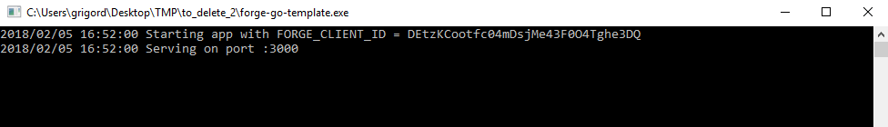
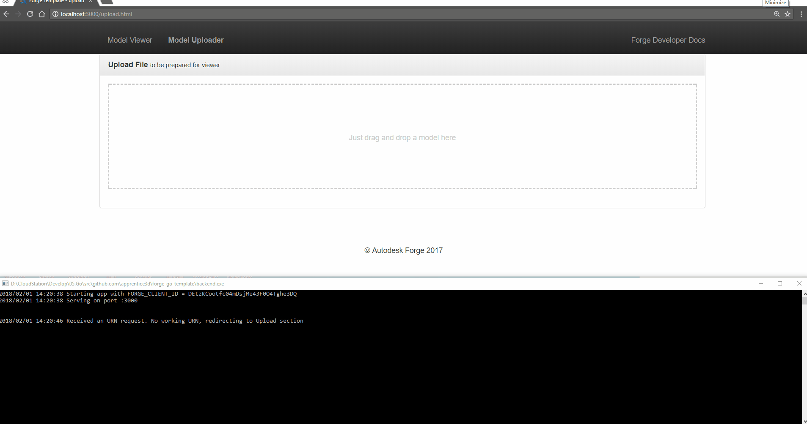

# forge-go-template

[](https://travis-ci.org/apprentice3d/forge-go-template)
[](https://goreportcard.com/report/github.com/apprentice3d/forge-go-template)


**Forge API:** [](http://developer-autodesk.github.io/)
[](http://developer.autodesk.com/)
[](http://developer.autodesk.com/)
[](http://developer.autodesk.com/)


`forge-go-template` is a simple working boilerplate for Forge projects served by Go.

## Setup
Set the ```FORGE_CLIENT_ID``` and ```FORGE_CLIENT_SECRET``` environment
variables with your Forge secrets.

Grab the zip archive from the [releases](https://github.com/apprentice3d/forge-go-template/releases) page
and un-archive it into favorite folder.

If you have Go already setup, and you want to build it by yourself, run:

    go get -u github.com/apprentice3d/forge-go-template

change to created/updated directory:

    cd $GOPATH/src/github.com/apprentice3d/forge-go-template

and start it by running

    go run main.go

or build it by running

    go build

## Usage

This app works on `port 3000`, so make sure it is available.

To start the app just run the `forge-go-template` executable.

If everything is setup, you should see a terminal window like this:



meaning that the web app can be accessed at `http://localhost:3000`

with following workflow:


